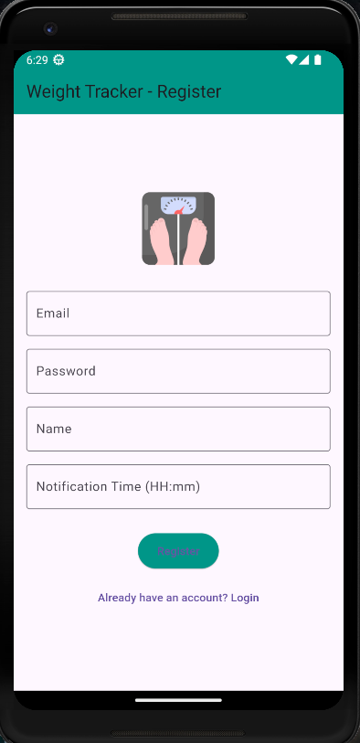
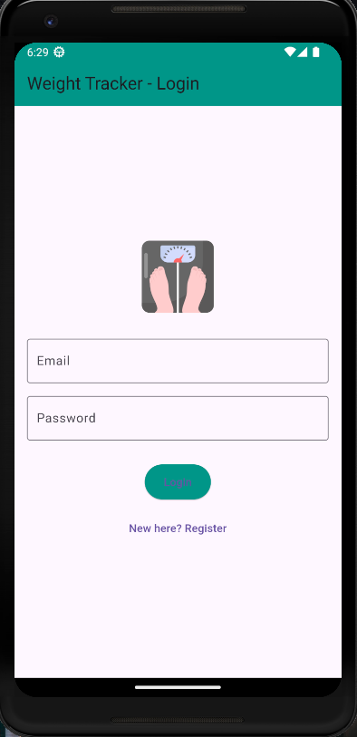
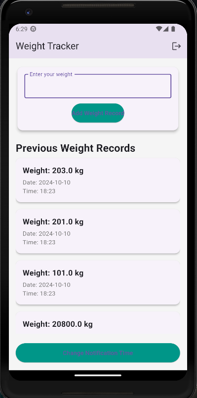

# TrackMe - Weight Tracker App

TrackMe is a Flutter application designed to help users log their daily weight and track progress over time. The app is integrated with Firebase for user authentication and Firestore for storing weight records. Users can set and update daily notification reminders, which are scheduled using Flutter's local notification package.

## Key Features:
- **Firebase Authentication**: Secure user login and registration.
- **Daily Weight Records**: Add, view, and manage daily weight entries.
- **Customizable Notifications**: Set and update daily reminders for logging weight.
- **Firestore Integration**: Real-time database for storing weight data and notification preferences.

## Images

## Technologies Used:
- **Flutter**: Cross-platform mobile app development.
- **Firebase Auth**: Secure user authentication.
- **Cloud Firestore**: Real-time NoSQL database.
- **Flutter Local Notifications**: Manage local notifications for scheduling daily reminders.
  
